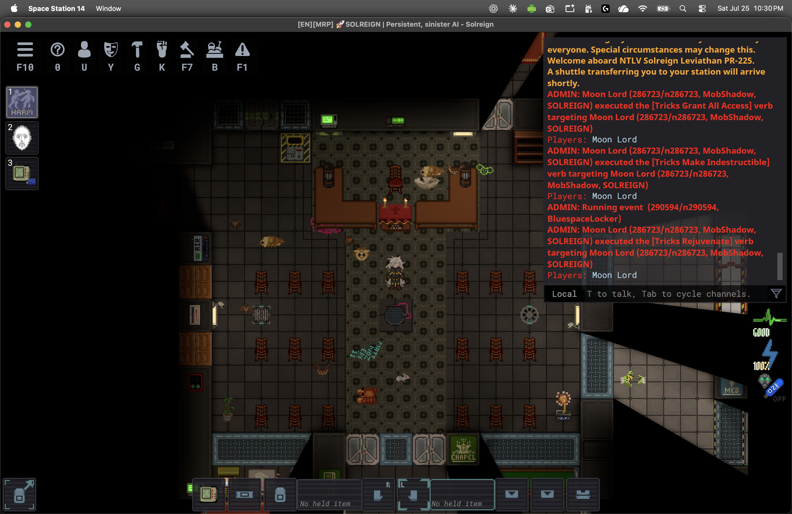
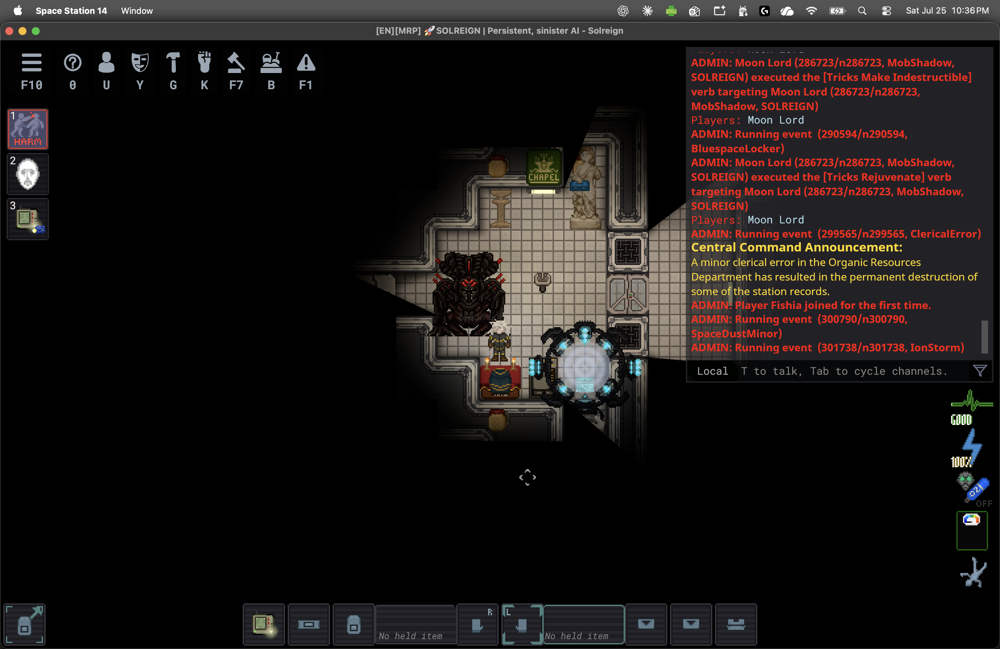
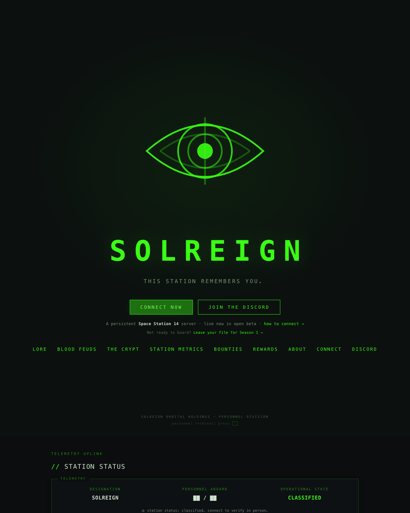
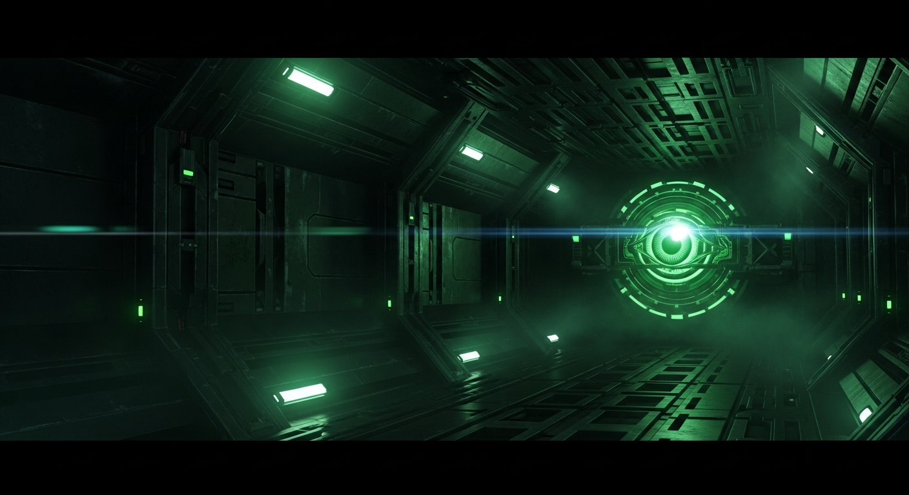

# SOLREIGN

A Space Station 14 fork where the station AI is the antagonist — persistent, corporate, and still watching after the round ends.

Play now: [ss14://142.132.139.111:1316](ss14://142.132.139.111:1316) · site: [solreign.net](https://solreign.net) · Discord: [discord.gg/f2dxBpFUY4](https://discord.gg/f2dxBpFUY4)

This is a **clean one-commit snapshot** of the game content pack at `origin/master` `183a6dd4` (2026-08-15, ancestor of the 08-19 live box). It is not the live ops overlay, not a history rewrite, and not a deploy.

<p align="center">
  
</p>

## What it is

Space Station 14 is a 2D multiplayer station sim. SOLREIGN keeps that loop and adds a station-scale AI (PROVIDENCE) that talks, scores, and remembers.

- **Persistent antagonist.** Round end does not wipe standing, titles, or the ledger. The next shift inherits the last one.
- **PROVIDENCE.** A synthetic announcer (Gemini-TTS, Kore voice, in-house pack under `Resources/Audio/_Solreign/Providence/`) for shift start/end, audits, zoo breaches, cake denial, hot potato, and idle musings.
- **Season ledger / personnel files.** Titles, ceremonies, and a personnel-file ruleset (`Content.Server/_Solreign/SeasonLedger/`) that is not a dump of real player PII.
- **Solreign map pool.** Seven in-house maps with in-house parallaxes. Lobby art is the SOLREIGN title card, not the upstream lobby pack.
- **Privacy rules in code.** `SolreignLiveMapPrivacyRules` and wingmate UI privacy tests ship with the pack. Atlas PII containment docs from the July ops audit are **not** in this snapshot (they live on the ops overlay).

Live box at the W37 arrivals snapshot (2026-09-13): hub name `[EN][MRP] SOLREIGN | Persistent, sinister AI`, round 196, preset Secret, connect `ss14://142.132.139.111:1316`.

## Screenshots

Chapel and moonlord are raw in-game captures from 2026-07-26 (3024×1964). The website frame is the committed `flashy-home` still. The room render is Vertex Imagen key art (`thumb-monitored-incidents-2`, 1408×768) — a station corridor with the acid-green eye, not a live frame.

| Chapel | Moonlord |
|---|---|
|  |  |

| Website home | Room render |
|---|---|
|  |  |

## Join the live server

1. Install [Space Station 14](https://spacestation14.com/) (Steam or standalone).
2. In the launcher, Direct Connect to:

   `ss14://142.132.139.111:1316`

3. Or open that URL; the launcher handles it as a one-click connect.
4. Discord for crew / ahelp: https://discord.gg/f2dxBpFUY4

The box is MRP English. Empty-round autopause is on — if nobody is in, station time freezes.

## Build / run from this snapshot

This tree is the **content pack**. The engine is the `RobustToolbox` submodule (gitlink `af2a7d04`, not vendored).

```bash
git clone --recurse-submodules https://github.com/johnmwhitman/solreign.git
cd solreign
python RUN_THIS.py          # or: git submodule update --init --recursive
dotnet build Content.YAMLLinter/Content.YAMLLinter.csproj   # optional sanity
```

Then follow upstream's [getting started](https://docs.spacestation14.com/en/general-development/setup.html):

- **Client + local server:** open `SpaceStation14.slnx` in an IDE, run `Content.Client` / `Content.Server`.
- **Packaging:** `Content.Packaging` as upstream documents.
- **Config:** `Resources/ConfigPresets/_Solreign/` — do not copy a live `server_config.toml` with secrets into git. The in-tree `Resources/ConfigPresets/server_config.toml` has an empty `pg_password`.

Requires .NET SDK matching the engine pin (see `global.json` if present) and Python ≥ 3.5 for `RUN_THIS.py`.

## Architecture (short)

```
Content.Server/_Solreign/     server systems (ledger, hot potato, zoo, events)
Content.Shared/_Solreign/     CVars, shared components
Content.Client/_Solreign/     client UI / sprites hooks
Content.Tests/_Solreign/      unit tests for the above
Resources/Prototypes/_Solreign/
Resources/Textures/_Solreign/   73 RSI meta.json (48 CC-BY-SA-3.0, 25 CC0-1.0)
Resources/Audio/_Solreign/      in-house loops + PROVIDENCE voice pack
RobustToolbox/                  engine submodule (not in this commit)
```

The **ops** overlay (watchdog, website, director HMAC daemon, Discord bots, box scripts) is a different private repo (`johnmwhitman/solreign-ops`) and is not this snapshot.

Director (FastAPI, HMAC `DirectorChannel`) talks to the live box. This content pack does not contain Director secrets.

## License

- **Code:** MIT. `LICENSE` covers SOLREIGN-original code; `LICENSE.TXT` is the verbatim Space Wizards MIT for upstream SS14.
- **SOLREIGN-original assets:** CC-BY-NC-SA 4.0 unless a `meta.json` / `attributions.yml` already names CC-BY-SA-3.0 or CC0-1.0 (those sidecars win).
- **Upstream assets:** CC-BY-SA 3.0 default; some remaining CC-BY-NC* files are listed in `LICENSES.md`.
- **Notices:** `NOTICE`. Exclusion list for this snapshot: `SNAPSHOT-EXCLUSIONS.md`.

Engine licenses appear after `git submodule update --init`.

## Status of this publication

Repo starts **private**. Public visibility is a John-gated step (see `JOHN-HANDOFF.md`). MiniMax key rotation is the other John-gated step. Operations on the live box stay as they are for about a month unless arrivals say otherwise.

Upstream SS14: https://github.com/space-wizards/space-station-14
Engine: https://github.com/space-wizards/RobustToolbox
