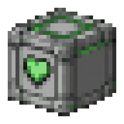
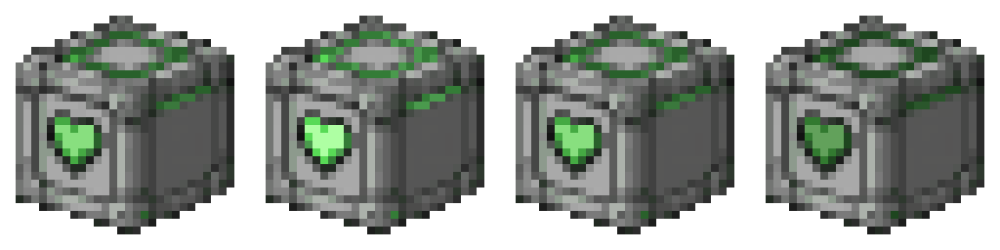
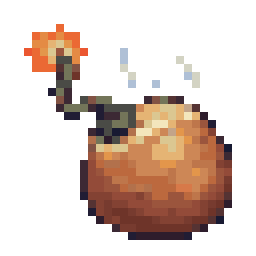
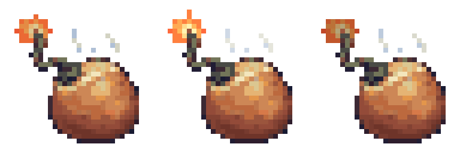

# Receipt — Solreign sprite-animation factory PILOT (feat/sprite-idle-anims)

**Date:** 2026-07-15 · **Branch:** `feat/sprite-idle-anims` (off `master` @ b74fe79d3f) · **Scope:** 2 sprites, game-visible idle animations + derived web GIFs. Post-Grand-Opening content — **NOT merged, NOT pushed, NOT deployed**; hand-off for orchestrator review.

## What changed

### 1. `Resources/Textures/_Solreign/companion_cube.rsi` — "heart pulse"
- `icon.png`: 32×32 single frame → **128×32 strip, 4 frames** packed left-to-right.
- `meta.json`: state `icon` gains `"delays": [[0.5, 0.5, 0.5, 0.5]]` (2.0 s gentle loop). License `CC-BY-SA-3.0` and copyright `Solreign (AI-generated, human-reviewed)` preserved verbatim.
- Method: programmatic PIL edit. Green-hue mask (HSV hue 0.2–0.45, sat > 0.35) selected exactly **65 pixels** — the acid-green heart + the green edge/corner accents. Sine brightness ramp ×1.00 / ×1.28 / ×1.00 / ×0.72 applied to masked pixels only; all grey body pixels byte-identical across every frame.

### 2. `Resources/Textures/_Solreign/hot_potato.rsi` — "fuse flicker"
- `icon.png`: 32×32 single frame → **96×32 strip, 3 frames**.
- `meta.json`: state `icon` gains `"delays": [[0.2, 0.15, 0.2]]` (0.55 s snappy loop). License/copyright preserved verbatim.
- Method: spark mask = bright warm pixels (HSV val > 0.75, sat > 0.3, hue < 0.18) **bounded to the fuse-tip region x∈[3,10], y∈[2,8]** — 27 pixels; the potato body's bright highlights were explicitly excluded by the region bound. Frame cycle: base → ×1.22 brightness + 1 px tip growth at (7,2) → ×0.82 brightness + tip pixel (7,3) off. Faint steam toggle: the 11 pre-existing cool-grey steam-wisp pixels (x∈[14,25], y∈[5,11], val > 0.6, sat < 0.25) alpha-cycle 255 / 150 / 210. Body pixels untouched.

### 3. Derived web assets (staged in the website worktree, **deliberately uncommitted** — orchestrator integrates)
- `website/public/assets/game/anim/companion_cube.gif` — 256×256 (8× NEAREST), 4 frames, true delays 500 ms each, `disposal=2`, transparent background.
- `website/public/assets/game/anim/hot_potato.gif` — 256×256 (8× NEAREST), 3 frames, true delays 200/150/200 ms, `disposal=2`, transparent background.
- `website/public/assets/game/anim/ANIM-MANIFEST.json` — both entries flipped `animated: true` with `file`, `frameCount`, per-frame `frameMs` list, updated `reason`, and `states_checked` corrected (`has_delays: true`, real tile counts). `_note` updated; original audit note preserved inside it. Re-parsed after write: valid JSON. **No website pages edited.**

## Before / after frame sheets (8× NEAREST)

| Sprite | Before | After |
|---|---|---|
| companion_cube |  |  |
| hot_potato |  |  |

## Verified (programmatic)

- **Round-trip parse:** both meta.json re-parsed; frame count in each PNG grid (width ÷ 32) exactly matches the delays list length; single direction as declared.
- **Frame 0 fidelity:** frame 0 of each new strip is **pixel-identical to the pristine master sprite** (diffed against `git show master:…/icon.png`).
- **Mask containment:** per-frame diffs vs frame 0 are exactly the mask sizes — cube: 65 px (frames 1,3; frame 2 = frame 0, correct sine midpoint); potato: 39 px (27 flame + 11 steam + 1 tip) / 38 px. Nothing outside the masks changed.
- **Prototype compatibility:** `portal_props.yml` (SolreignCompanionCube + structure variant) and `hot_potato.yml` reference `state: icon` — state name unchanged, so the animation plays with **zero YAML edits** (SS14 auto-animates any state with `delays`).
- **GIF integrity:** decoded every frame of both GIFs — correct frame counts, true durations, disposal=2, all four corners alpha-0 on every frame (transparency without trails).
- **YAML linter:** `dotnet run --project Content.YAMLLinter -c DebugOpt` — exit 0, **"No errors found in 45081 ms."** (only pre-existing CS0618/RA0033 C# warnings, unrelated to this change).

## Needs John's eyeball

- **In-game visual confirmation at the dev client.** The frame-extraction round-trip proves the client *will* read 4/3 frames at the declared delays, but the actual rendered pulse/flicker feel (amplitude ×1.28/×0.72 on the cube, the 0.15 s flicker beat on the potato) needs a human look: spawn `SolreignCompanionCube` / the hot potato and watch a loop. Tuning knobs are trivial (amplitude + delays) if the pulse reads too strong/weak.
- GIF appearance on the website dark background (transparent GIFs verified, but aesthetic call is his).

## Context notes for the orchestrator

- `docs/WORKTREE-MAP.md` **does not exist** in HEAD or on disk (task referenced it); the serialization rule was applied from the task text itself.
- At pilot start, `feat/humanoid-move-bob` (worktree `~/AI/solreign-trees/humanoid-move-bob`) had **3 untracked new files** (uncommitted wave in flight). This pilot proceeded in its own fresh worktree because its paths (`Resources/Textures/_Solreign/{companion_cube,hot_potato}.rsi` only) are fully disjoint from move-bob's C# paths and this branch stops before merge — **serialize at merge time as usual; rebase is trivially clean.**
- Factory script preserved at `docs/receipts/sprite-idle-anims-factory.py` (reproducible: reads pristine sprites, regenerates all frames/GIFs/sheets).
